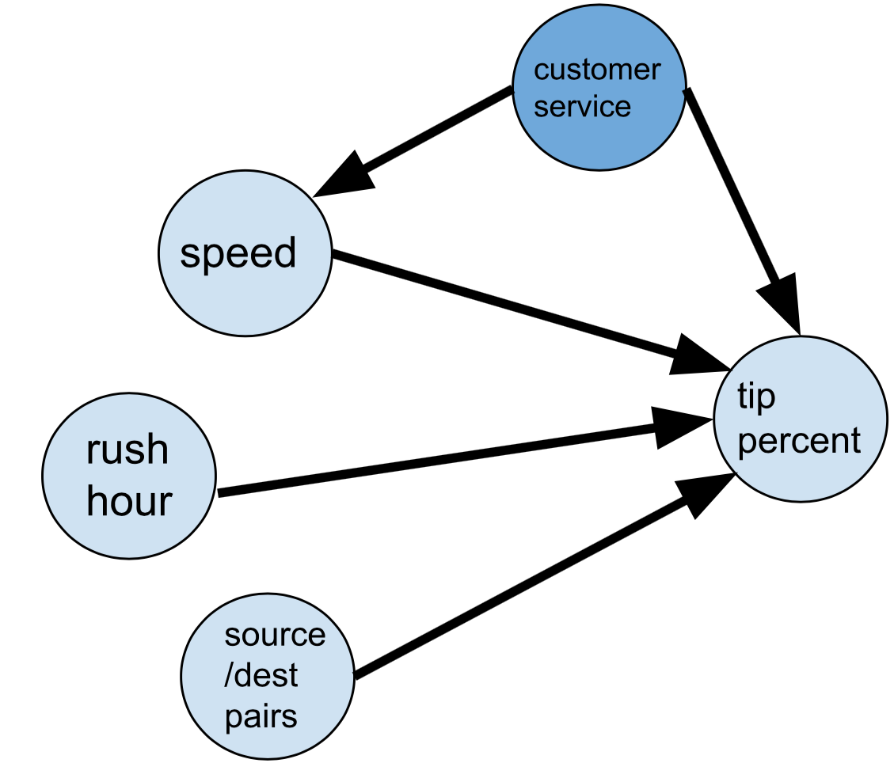

```{r setup, include=FALSE, results='hide', message=FALSE}
knitr::opts_chunk$set(echo = TRUE)
```

```{r message=FALSE, warning=FALSE, include=FALSE}
#loading appropriate libraries
library(tinytex)
library(tidyr)
library(plm)
library(dplyr)
library(arrow)
library(lubridate)
library(magrittr)
library(stargazer)
library(ggplot2)
```

# Introduction

In New York, tipping taxi drivers is a customary expression of satisfaction with a ride, with tip percentages usually ranging from 15% to 20% of the total fare.
Tipping is generally expected, but the percentage of the tip can be a key indicator of the passengers' overall experience during the ride.
For drivers, tips are an important slice of their take-home wages, separate from their usual balance of revenue after expenses incurred.
This is important, since divers' earnings can be offset by over \$10,000 per year in gas, rental, and maintenance expenses.
Additionally, a comprehensive 2016 report on the behaviors that maximize taxi drivers' earnings, more experienced drivers earn more in general, and in tips.[^1]
With over 13,000 cabs in the city, competition also incentivizes drivers to optimize their earnings and tips.
Our study seeks to understand how NYC yellow taxi drivers' behavior plays a role in customers' tip percentages, specifically how their average velocity, an aspect of strategic driving, affects the tip percentage awarded by passengers at the end of a ride.
In other words, does faster, more efficient driving yield bigger tips from customers percentage-wise?
Our null hypothesis is that faster driving has no effect on tip percentage, while our alternative hypothesis is that faster driving does have an effect on tip percentage.
By applying a set of time-invariant fixed effects regression models, we attempt to isolate average velocity by controlling for heterogeneity across factors like traffic and distinct pick-up and drop-off TLC Taxi zones of rides.

[^1]: <https://web.archive.org/web/20160707084313id_/http://home.uchicago.edu/~haggag/Learning_by_Driving.pdf>

```{r message=FALSE, warning=FALSE, include=FALSE}
# Data Cleaning

# loading in data

taxi_data <- read_parquet("yellow_tripdata_2023-09.parquet")


# only including credit card payments in dataset because cash payment tips are not recorded

taxi_data <- subset(taxi_data, payment_type == 1)


# only including rides from september (there were some august rides)

taxi_data <- subset(taxi_data, month(tpep_pickup_datetime)==9)


# adding tip_percent column

taxi_data$tip_percent <- (taxi_data$tip_amount/taxi_data$total_amount)*100


# adding mph column

taxi_data$avg_speed_mph <- taxi_data$trip_distance/as.numeric(difftime(taxi_data$tpep_dropoff_datetime, taxi_data$tpep_pickup_datetime, units = 'hours'))


# only including rides with a feasible average speed (less than 100, there were a few misrecorded observations with mph's in the thousands)

taxi_data <- subset(taxi_data, avg_speed_mph < 100 & avg_speed_mph > 0)


# adding day_of_month column

taxi_data$day_of_month <- day(taxi_data$tpep_pickup_datetime)
taxi_data$day_of_week <- weekdays(taxi_data$tpep_pickup_datetime)

# one-hot-encoding/binarizing categorical columns

# congestion_surcharge: binarize and create new column is_congested
taxi_data$is_congested<- as.numeric(taxi_data$congestion_surcharge > 0)
# Airport_fee: binarize and create new column called is_airport_pickup
taxi_data$is_airport_pickup <- as.numeric(taxi_data$Airport_fee > 0)
# PULocationID and DOLocationID: dummify existing columns
taxi_data$PULocationID<-as.factor(taxi_data$PULocationID)
taxi_data$DOLocationID<-as.factor(taxi_data$DOLocationID)


# adding source_destination_pair
taxi_data$source_destination_pair <- paste(taxi_data$PULocationID, taxi_data$DOLocationID)


# adding pickup_hour and is_rush_hour columns
taxi_data$pickup_hour <- hour(taxi_data$tpep_dropoff_datetime)
taxi_data$is_weekday <- ifelse(wday(taxi_data$tpep_dropoff_datetime, week_start = 1) < 6, 1, 0)
taxi_data$is_rush_hour <- ifelse(((taxi_data$pickup_hour > 7 & taxi_data$pickup_hour < 9) | (taxi_data$pickup_hour > 15 & taxi_data$pickup_hour < 17)) & (taxi_data$is_weekday == 1), 1, 0)
taxi_data$is_overnight <- ifelse(taxi_data$pickup_hour > 0 & taxi_data$pickup_hour < 4, 1, 0)


# getting rid of infinite and NA values 
numeric_cols <- sapply(taxi_data, is.numeric)
taxi_data[numeric_cols] <- lapply(taxi_data[numeric_cols], function(x) {
  x[!is.finite(x)] <- NA
  x
})

taxi_data <- na.omit(taxi_data)

```

# Data & Methodology:

The data for this study comes from the New York City Taxi and Limousine Commission's Yellow Taxi Trip Record Data, specifically all of the September 2023 records.
Initially, there were 2.8 million taxi ride records, each corresponding to a single taxi ride within the given timeframe.
We filtered the dataset to include only credit card payments (due to unrecorded cash tips).
Furthermore, we have filtered out rides with unfeasible average velocities, above 100 mph and below 0 mph.
After removing rows with null values, we ended up with 2.1 million yellow taxi ride records.
To calculate average speed, we divided the distance traveled by the time difference between pick-up and drop-off in hours.
For tip percentage, we divided the tip amount by the total fare after fees.
Looking closely at the distributions of average velocity and tip percentage, we can see a strong right skew in both plots.
Average velocity follows a classic smooth right skew with a mean of 11 mph, which makes sense considering the tightly packed nature of NYC, while tip percentage follows a less smooth distribution, with a sharp peak between 15 and 20 percent, which aligns with US tipping conventions.[^2]

[^2]: <https://www.nyc.gov/site/tlc/about/tlc-trip-record-data.page>

```{r echo=FALSE, fig.width=4,fig.height=3,fig.cap="\\label{fig:figs}Distributions"}
# Histograms
par(mfrow = c(1, 2))
hist(taxi_data$tip_percent, main = 'tip distribution', xlab ='tip percentage', breaks = 35)
hist(taxi_data$avg_speed_mph, main = 'velocity distribution', xlab = 'average velocity (mph)', breaks = 50)
```

Before our analysis, it's crucial to address confounders when using velocity as a proxy for driver efficiency and aggression.
While a driver's behavior impacts average velocity, the primary variations arise from traffic conditions and distinct pick-up and drop-off locations.
New York City has 252 TLC Taxi zones, following a grid-like structure dividing up the city into distinct squares.
Each zone of the grid exhibits unique characteristics that make average velocities and other driving conditions across source and destination pairs unique.
To control for all possible source-destination pairs in our sample in our analysis, we employ a time-invariant fixed effects model, treating source-destination pairs as our "names of entity" and day of the week as our "time ID variable." Including these time-invariant fixed effects ensures that we account for within-group variations of each pair of pick-up and drop-off locations that do not vary throughout days of the week.
We also control the time of day with a rush hour indicator (7 am to 10 am and 3 pm to 6 pm on weekdays), as traffic congestion significantly influences driver velocity.
We fit regressions of the form:

$$tip \: percent = \beta_1  \cdot avg \:velocity + \beta_2  \cdot rush \: hour + Z  \cdot \gamma +fixed \: effects$$

where $\beta_1$ represents the change in tip percentage per mph increase in average velocity, $\beta_2$ represents the average difference in tip percentage between trips during and not during rush hour, Z is a row vector of additional covariates, $\gamma$ is a column vector of the corresponding coefficients, and fixed effects represent the pooled effects of each source-destination zone pair.
Due to our many source destination pairs derived from the pickup and dropoff zones in each row of our dataset (each ride), we would overload a classic linear model by attempting to calculate coefficients for each pair.
Instead, a fixed effects model allows a bundled effect of pickup and dropoff pairings to control for routes that may be associated with more or less traffic, and therefore higher or lower average speeds.
As such, we must assess our model based on the fixed effects regression assumptions.[^3]
First, an ocular test -- plotting predictions (which represent all X's) against residuals -- reveals that the zero conditional mean assumption is satisfied.

[^3]: <https://tilburgsciencehub.com/building-blocks/analyze-data/regressions-paneldata/>

```{r figs, echo=FALSE, message=FALSE, warning=FALSE, fig.width=4,fig.height=2.5,fig.cap="\\label{fig:figs}Predictions vs Residuals"}
# Plotting Predictions vs. Residuals to assess the Zero Conditional Mean assumption
fixed_effects_model3 <- plm(tip_percent ~ avg_speed_mph + is_rush_hour + passenger_count + tolls_amount, 
                          data = taxi_data,
                          index = c('source_destination_pair', 'day_of_week'),
                          model = "within"  # "within" specifies fixed effects
)
preds <- predict(fixed_effects_model3)
res <- resid(fixed_effects_model3)
taxi_data$preds <- preds
taxi_data$res <- res

plot_1 <-taxi_data %>% ggplot(aes(preds, res)) +
  geom_point() + stat_smooth() + 
  labs(title = 'Predictions vs. Residuals, assessing Zero Conditional Mean assumption', x = 'predictions', y = 'residuals')

plot_1
```

```{r message=FALSE, warning=FALSE, include=FALSE}
# simple fixed effects model 1: avg_speed_mph, is_rush_hour
fixed_effects_model <- plm(tip_percent ~ avg_speed_mph + is_rush_hour, 
                          data = taxi_data,
                          index = c('source_destination_pair', 'day_of_week'),
                          model = "within"  # "within" specifies fixed effects
)
# simple fixed effects model 2: avg_speed_mph, is_rush_hour, passenger_count
fixed_effects_model2 <- plm(tip_percent ~ avg_speed_mph + is_rush_hour + passenger_count, 
                          data = taxi_data,
                          index = c('source_destination_pair', 'day_of_week'),
                          model = "within"  # "within" specifies fixed effects
)
# simple fixed effects model 3: avg_speed_mph, is_rush_hour, passenger_count, tolls_amount
fixed_effects_model3 <- plm(tip_percent ~ avg_speed_mph + is_rush_hour + passenger_count + tolls_amount, 
                          data = taxi_data,
                          index = c('source_destination_pair', 'day_of_week'),
                          model = "within"  # "within" specifies fixed effects
)
```

```{r echo=FALSE, message=TRUE, warning=FALSE, results='asis'}
# summary of results
stargazer(fixed_effects_model, fixed_effects_model2, fixed_effects_model3, type = "latex", title = "Regression Results", header = FALSE)
```

Secondly, we must assess whether regressors associated with each trip are from independent and identically distributed draws.
This assumption may not necessarily hold.
For example, there may be patterns of associated trips based on common commute paths from certain neighborhoods, at certain times of day.
Additionally certain ride behavior and source-destination pairs may be more likely in the month of September than other months, perhaps due to city-wide events and weather conditions.
However, for this model we inherently assume that each ride is independent from one another across source-destination pairs, but not within entities (where it is okay for there to be autocorrelation over time).
Thirdly, we can assume that -- given the practical limits of vehicle speed and tips as well as our filtering system for outliers -- that large outliers are not likely.
Finally, there is no perfect collinearity, or even near-perfect collinearity.
We deliberately chose not to include whether or not a passenger was charged a congestion fee because of the collinearity between rush hour times and congestion.
We also chose not to specify whether or not a ride was an airport pick-up because this information is already accounted for in the source-destination fixed effects variable of our model.

The Regression Results Table summarizes results from three representative regressions (using the fixed effects plm in R automatically computes the clustered standard errors that accounts for autocorrelation within source-destination pairs).Across all models, the coefficient on average velocity is highly statistically significant, with point estimates between 0.009 and 0.010.
For context, according to model 3, if the average velocity increases by 10, while holding other factors constant, there is a 0.10 increase in the tip percentage.
This suggests that a driver's improved efficiency, particularly in average velocity, may lead to a very slight increase in customer tipping.
Across all models, the rush hour indicator variable's coefficient was also highly statistically significant, with point estimates around 0.189.
Our models suggest that, on average, rides during rush hour receive a higher tip percentage compared to non-rush hour rides.
Particularly, holding average velocity, passenger count, and source-destination fixed effects constant, the average tip percentage difference between rush hour and non-rush hour rides is about 0.189 percent.
Finally, the passenger count and already incurred fees from tolls demonstrate a slight negative relationship with tip percentage.
The model suggests that for every additional passenger in a given ride, there may be a 0.026 to 0.027 percent decrease in tip.
The model also suggests that for every dollar of additional fees incurred due to tolls, there may be a 0.022 percent decrease in tip.
While these predicted effects are negative, their scales are certainly small.Overall all of our results are negligible in scale, but still statistically significant.

# Limitations:

Firstly, our time-invariant fixed effects model accounts for within-group variations of each pair of pick-up and drop-off locations that are fixed throughout each day of the week, but it may have been more optimal to consider this within-group variability as fixed throughout each day of the month.
This modeling choice was ambiguous, and unaccounted for temporal factors may pose implications for bias.
Secondly, average speed may not adequately represent how strategic a driver is and how efficient the trip is.
We assume, however, that to a certain extent speed is behavioral, and can capture aggression if external factors are controlled for.
While we have controlled for source-destination pairs and rush hour in our model, there are certain behavioral variables that we do not have the data to control for.
For example, a driver's demeanor or customer service skills may significantly impact a passenger's tip percentage, but we do not have access to any measures of those factors.
Omitting customer service skills would create bias in the positive direction, pushing away from zero (since both customer service skills and average speed have a positive relationship with tip_percentage), meaning the effect that we find of average speed on tip percentage may be inflated.

{width="200"}

Additionally, our analysis assumes that tip percentage accurately represents customer satisfaction with a ride.
However, that is not always the case, as tipping is a deeply rooted American habit and social expectation, often done regardless of customer satisfaction.
Furthermore, some people are baseline "good" tippers and others "bad." That being said, we reason that there is a margin, probably resulting in the difference of a few dollars in most cases, of percentages that customers tip within that can be influenced by their ride experience.
Our results may also be biased by excluding about 400k rides where customers paid and tipped in cash.
We are uncertain how the tipping behavior between card and cash-paying riders may have changed our results due to a lack of cash tips data.
Finally, our sample of cab rides from September 2023 may not represent the entire population of all NYC cab rides accurately because of the unaccounted for unique characteristics of this particular month in time, compared with all other cab rides in the history of the NYC Taxi Commission.

# Conclusion:

Given our findings, we can conclude that, across all models, a driver's average speed had an exceedingly small but still statistically significant impact on tip percentage, holding traffic and in-group source-destination pairs constant.
We can cautiously reject the null hypothesis that states that a driver's velocity has no impact on a customer's tipping.
However, due to some major limitations -- for instance, a lack of other behavioral data on drivers' customer service skills, the habitual, yet personal nature of tipping, the fact that our design is not a randomized experiment, and the omission of time-variant variables in our model -- we cannot infer causality between more aggressive driving and higher customer tip percentage.
We have found that faster driving is associated with receiving larger tips percentage-wise (albeit on a negligibly small scale) when controlling for external fixed effects like pickup and dropoff location and time-of-day-related traffic conditions.
